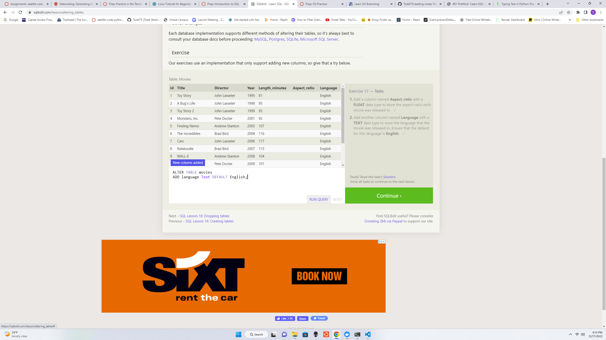

# 401 PreWork "Learn SQL"

## Questions

Problem One

Problem Two

Problem Three

Problem Four

Problem Five

Problem Six

Problem Thirteen

Problem Fourteen

Problem Fifteen

Problem Sixteen

Problem Seventeen

Problem Eighteen

### What I Learned

I noticed that most of the commands in Python seem to all be capitalized.

## Resources

[SQL Bolt Lessons](https://sqlbolt.com/lesson/select_queries_with_joins)

## Return to the Table of Contents

[Table of Contents](https://todd75.github.io/reading-notes/)
