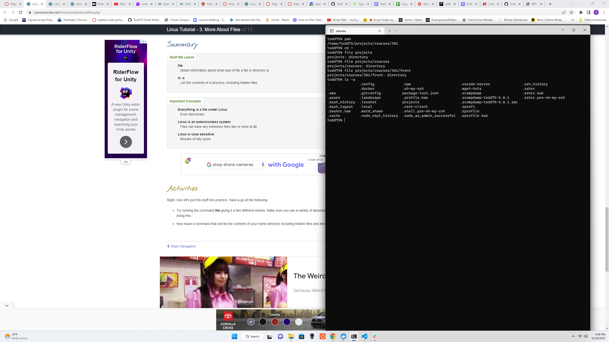
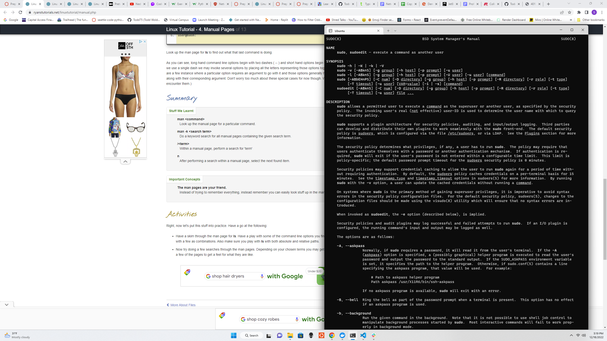
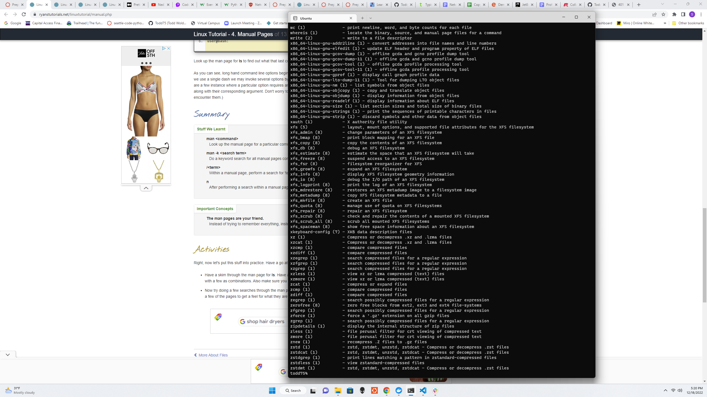
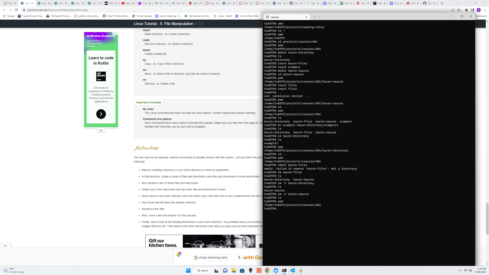
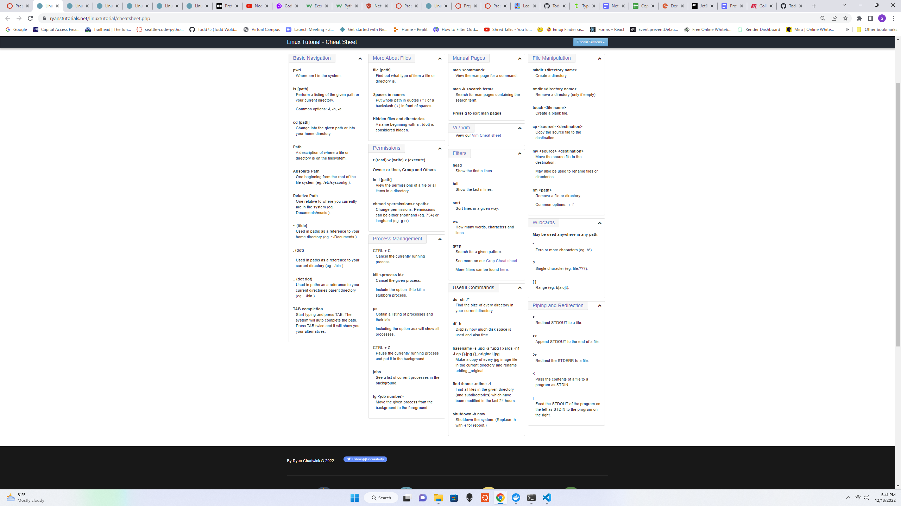

# 401 PreWork "Practice in the Terminal"

## Questions

### The Command Line

A command line, or terminal, is a text based interface to the system. You are able to enter commands by typing them on the keyboard and feedback will be given to you similarly as text.

The command line typically presents you with a prompt. As you type, it will be displayed after the prompt. Most of the time you will be issuing commands.

Within a terminal you have what is known as a shell. This is a part of the operating system that defines how the terminal will behave and looks after running (or executing) commands for you. There are various shells available but the most common one is called bash which stands for Bourne again shell. This tutorial will assume you are using bash as your shell.

If you would like to know which shell you are using you may use a command called echo to display a system variable stating your current shell. echo is a command which is used to display messages.

*This section detailed how to pull up your terminal and what the command line's text based interface is. It showed us how to use echo to check your $SHELL. Pretty simple commands at this point.*

### Basic Navigation

pwd stands for Print Working Directory, ls stands for list the contents of a directrory, and cd stands for change directory.

There are 2 types of paths we can use, absolute and relative. Whenever we refer to a file or directory we are using one of these paths. Whenever we refer to a file or directory, we can, in fact, use either type of path (either way, the system will still be directed to the same location).

To begin with, we have to understand that the file system under linux is a hierarchical structure. At the very top of the structure is what's called the root directory. It is denoted by a single slash ( / ). It has subdirectories, they have subdirectories and so on. Files may reside in any of these directories.

Absolute paths specify a location (file or directory) in relation to the root directory. You can identify them easily as they always begin with a forward slash ( / )

Relative paths specify a location (file or directory) in relation to where we currently are in the system. They will not begin with a slash.

*This section went into more detail about how to move around the files using your command line interface. Showed us how to move and change from directoies and see what files are in thos directories with the ls command.*

### More About Files

Everything is actually a file in Linux!!!

Linux is Case Sensitive.

NO Spaces in Names.

file command gives information on what type of file a file or directory is. Linux is extensionless.

ls -a shows the hidden files in the list as well.

*This module showed us how to access hidden files and also gave us some syntax knowledge. Such as being case sensitive, everything is a file, and Linux is extensionless.*

### Manual Pages

The manual pages are a set of pages that explain every command available on your system including what they do, the specifics of how you run them and what command line arguments they accept. Some of them are a little hard to get your head around but they are fairly consistent in their structure so once you get the hang of it it's not too bad. You invoke the manual pages with the following command:

`man <command to look up>`

`man -k <search term>` is used to do a keyword search on manual pages.

*This module was pretty useful as I hadn't used either of the commands that were introduced in it before. Being able to search a manual page actually seems pretty useful and is definately a needed skill.*

### File Manipulation

Use mkdir followed by the directory name to creat a new directory and rmdir to remove a directory.

The command touch creates a blank file.

`cp [options] <source> <destination>` is used to copy a file.

`mv [options] <source> <destination>` is used to move a file.

`rm [options] <file>` is used to remove a file & if you need to remove a non empty direcoty use `rm -r`.

*This section was particulally useful as moving, saving, creating, removing files is a neccisity for any programmer. I especiallty found the removing on non empty direcotories useful.*

### Cheat Sheet

*This maybe the most usefull page of information yet as cheat sheets of commands are always appreciated. There are still a couple questions I have even with the cheet sheet. In 301 my command line showed what file I was working in and now it shows my username with a % after it. Which is not a big deal I can pwd and make sure I am in the file I want to be in but before it just displayed it for me.*

## Resources

- [Cheat Sheet](https://ryanstutorials.net/linuxtutorial/cheatsheet.php)
- [File Manipulation](https://ryanstutorials.net/linuxtutorial/filemanipulation.php)
- [Manual Pages](https://ryanstutorials.net/linuxtutorial/manual.php)
- [More About Files](https://ryanstutorials.net/linuxtutorial/aboutfiles.php)
- [Basic Navigation](https://ryanstutorials.net/linuxtutorial/navigation.php)
- [The Command Line](https://ryanstutorials.net/linuxtutorial/commandline.php)
- [Linux Tutorial](https://ryanstutorials.net/linuxtutorial/)

## Return to the Table of Contents

[Table of Contents](https://todd75.github.io/reading-notes/)
